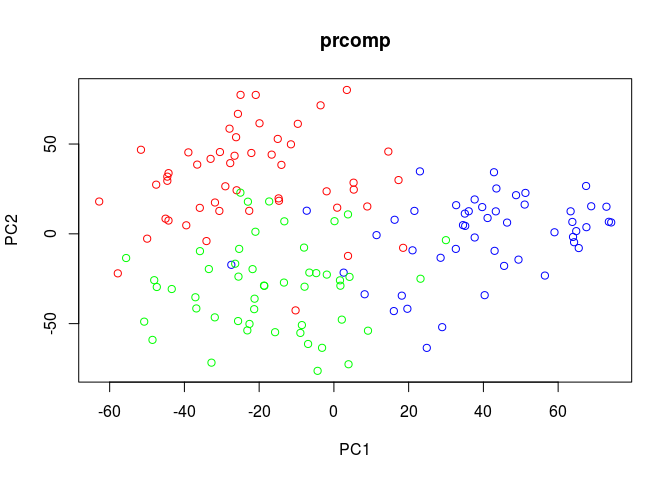

<!-- README.md is generated from README.Rmd. Please edit that file -->
Sparse supervised k-means clustering
====================================

Supervised (and unsupervised) sparse k-means clustering, with single-cell RNA-seq data in mind. The clustering can be performed using either a traditional (squared) euclidean distance, or via a dissimilarity matrix that takes into account the drop-out phenomenom in single-cell RNA-seq data. The dissimilarity measure is obtained through the single-cell analysis package CIDR\*.

\*For more details about *CIDR*, refer to the [github page](https://github.com/VCCRI/CIDR) or the [paper](https://genomebiology.biomedcentral.com/articles/10.1186/s13059-017-1188-0): Peijie Lin, Michael Troup, Joshua W.K. Ho, CIDR: Ultrafast and accurate clustering through imputation for single-cell RNA-seq data. *Genome Biology* 2017 Mar 28;18(1):59.

*scluster* is maintained by Dr Joshua Ho <j.ho@victorchang.edu.au>.

Getting Started
---------------

-   Make sure your version of R is at least 3.1.0.
-   *scluster* and *CIDR* have been tested primarily on the Linux and Mac platforms. *CIDR* has also been tested on the Windows platform - however this requires the use of an external software package *Rtools*.
-   If you are on the Windows platorm, ensure that [Rtools](https://cran.r-project.org/bin/windows/Rtools/) is installed. Rtools is software (installed external to R) that assists in building R packages, and R itself. Note that the downlaod for *Rtools* is in the order of 100M.
-   Install the CRAN package *devtools* package which will be used to install *CIDR* and its dependencies:

``` r
## this is an R command
install.packages("devtools")
```

-   Install the *CIDR* and *scluster* packages directly from the Github repository (including any dependencies):

``` r
## this is an R command
devtools::install_github("VCCRI/CIDR")
devtools::install_github("VCCRI/scluster")
## Note that for some Windows platforms, you may be asked to re-install RTools
## - even though it may already have been installed.  Say yes if prompted.
## Your windows platform may require the specific version of RTools being suggested.
##
## For Mac platforms, ensure that the software "Xcode" and "Command Line Tools" are
## installed, by issuing the following command from a terminal prompt:
##  /usr/bin/clang --version
##
```

Examples
========

Simulated Data
--------------

Test the newly installed *scluster* package:

``` r
library(scluster)
example("scluster")
#> 
#> sclstr> par(ask=FALSE)
#> 
#> sclstr> ## Generate simulated single-cell RNA-Seq tags.
#> sclstr> N=3 ## 3 cell types
#> 
#> sclstr> k=50 ## 50 cells per cell type
#> 
#> sclstr> sData <- scSimulator(N=N, k=k)
#> 
#> sclstr> ## tags - the tag matrix
#> sclstr> tags <- as.matrix(sData$tags)
#> 
#> sclstr> cols <- c(rep("RED",k), rep("BLUE",k), rep("GREEN",k))
#> 
#> sclstr> ## Standard principal component analysis.
#> sclstr> ltpm <- log2(t(t(tags)/colSums(tags))*1000000+1)
#> 
#> sclstr> pca <- prcomp(t(ltpm))
#> 
#> sclstr> plot(pca$x[,c(1,2)],col=cols,pch=1,xlab="PC1",ylab="PC2",main="prcomp")
```



    #> 
    #> sclstr> ## use scluster to cluster the data - unsupervised, euclidean distance
    #> sclstr> ## The input for scluster should be a tag matrix.
    #> sclstr> nCluster <- 3
    #> 
    #> sclstr> scSim <- sclDataConstructor(tags)
    #> 
    #> sclstr> scSim <- sclust(scSim, nCluster=nCluster, nf=200, 
    #> sclstr+                 max.nIter=10, markers=NA, supervise=FALSE, alpha=0)
    #> 
    #> sclstr> ## Use Adjusted Rand Index to measure the accuracy of the clustering output by cidr.
    #> sclstr> scluster::adjustedRandIndex(scSim@cluster,cols)
    #> [1] 0.979932
    #> 
    #> sclstr> ## 0.98
    #> sclstr> 
    #> sclstr> ## Now redo the clustering using the CIDR "distance"
    #> sclstr> scSim <- sclDataConstructor(tags)
    #> 
    #> sclstr> scSim <- sclust(scSim, nCluster=nCluster, nf=200, dist="cidr",
    #> sclstr+                 max.nIter=10, markers=NA, supervise=FALSE, alpha=0)
    #> 
    #> sclstr> ## Use Adjusted Rand Index to measure the accuracy of the clustering output by cidr.
    #> sclstr> scluster::adjustedRandIndex(scSim@cluster,cols)
    #> [1] 1
    #> 
    #> sclstr> ## 1.0
    #> sclstr> 
    #> sclstr> ## Now perform clustering using the parameter "s" instead of "nf".
    #> sclstr> ## NOTE that we use either but not both of the parameters "s" or "nf".
    #> sclstr> ## s - A tuning parameter determines the sum of weights for all features.
    #> sclstr> ## nf - Parameter that determines the number of features (with non-zero weight) 
    #> sclstr> ## used for clustering.
    #> sclstr> scSim <- sclDataConstructor(tags)
    #> 
    #> sclstr> scSim <- sclust(scSim, nCluster=nCluster, s=10, 
    #> sclstr+                 max.nIter=10, markers=NA, supervise=FALSE, alpha=0)
    #> 
    #> sclstr> ## Use Adjusted Rand Index to measure the accuracy of the clustering 
    #> sclstr> ##output by cidr.
    #> sclstr> scluster::adjustedRandIndex(scSim@cluster,cols)
    #> [1] 1
    #> 
    #> sclstr> ## 1.0
    #> sclstr> 
    #> sclstr> ## Input tags are cpm. If using cidr distance, it is preferable to use raw 
    #> sclstr> ## tags, unless they are not available.
    #> sclstr> tags_cpm <- t(t(tags)/colSums(tags))*1000000
    #> 
    #> sclstr> scSim <- sclDataConstructor(tags, tagType = "cpm")
    #> 
    #> sclstr> scSim <- sclust(scSim, nCluster=nCluster,max.nIter=10, 
    #> sclstr+                 markers=NA, supervise=FALSE, nf=300, alpha=0)
    #> 
    #> sclstr> scluster::adjustedRandIndex(scSim@cluster,cols)
    #> [1] 0.979932
    #> 
    #> sclstr> ## 0.98
    #> sclstr> 
    #> sclstr> 
    #> sclstr>

Biological Datasets
-------------------

Examples of applying *CIDR* to real biological datasets can be found at this [Github repository](https://github.com/VCCRI/CIDR-examples). The name of the repository is *CIDR-examples*. The interested user may use these resources to test *scluster*.

Clicking on the *Clone or Download* button in the Github repository for *CIDR-examples* will enable the user to download a zip file containing the raw biological data and the R files for the examples. The user can then extract the files and run the provided R examples.

### Human Brain scRNA-Seq Dataset

*CIDR-examples* contains a human brain single-cell RNA-Seq dataset, located in the *Brain* folder. In this dataset there are 420 cells in 8 cell types after we exclude hybrid cells.

Reference for the human brain dataset:

Darmanis, S. *et al.* A survey of human brain transcriptome diversity at the single cell level. *Proceedings of the National Academy of Sciences* 112, 7285–7290 (2015).

### Human Pancreatic Islet scRNA-Seq Dataset

*CIDR-examples* contains a human pancreatic islet single-cell RNA-Seq dataset, located in the *PancreaticIslet* folder. In this dataset there are 60 cells in 6 cell types after we exclude undefined cells and bulk RNA-Seq samples.

Reference for the human pancreatic islet dataset:

Li, J. *et al.* Single-cell transcriptomes reveal characteristic features of human pancreatic islet cell types. *EMBO Reports* 17, 178–187 (2016).

Troubleshooting
---------------

### Masking of *hclust*

*CIDR* utilises the *hclust* function from the base *stats* package. Loading *CIDR* masks *hclust* in other packages automatically. However, if any package with an *hclust* function (e.g., *flashClust*) is loaded after *CIDR*, the name clashing can possibly cause a problem. In this case unloading that package should resolve the issue.

### Reinstallation of *CIDR* - cidr.rdb corruption

In some cases when installing a new version of *CIDR* on top of an existing version may result in the following error message:

`Error in fetch(key) : lazy-load database '/Library/Frameworks/R.framework/Versions/3.3/Resources/library/cidr/help/cidr.rdb' is corrupt`

In this case, one way to resolve this issue is to reinstall the *devtools* package:

``` r
install.packages("devtools")
## Click “Yes” in “Updating Loaded Packages”
devtools::install_github("VCCRI/CIDR",force=TRUE)
```

Some users might have installed an older version of RcppEigen. CIDR requires RcppEigen version &gt;=0.3.2.9.0. Please re-install the latest version of this package if necessary.
